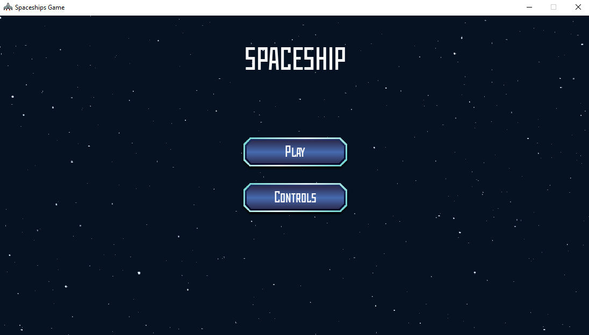

# SpaceShip Game

## General description:

- Survive as much as you can! Enemies will not stop comming.
- Get as many points as you can.
- Each enemy has a diferent behavior so watch his movements and scape, before you ran uot of lifes.
- In your adventure yo can get some power ups to help yo survive. Go get them before they desapear.
- You wan a more challenging experience? Try hard mode.

## Controls:

<table>
<thead>
  <tr>
    <th>Player</th>
    <th>Buttons</th>
    <th>Action</th>
  </tr>
</thead>
<tbody>
  <tr>
    <td rowspan="3"><image src="./game/assets/Spaceship/spaceship.png" width = 120 height=150></image></td>
    <td>Left click</td>
    <td>Shoot</td>
  </tr>
  <tr>
    <td>W, A, S, D</td>
    <td>Move player</td>
  </tr>
  <tr>
    <td>Mouse</td>
    <td>Use mouse to point where to shoot</td>
  </tr>
</tbody>
</table>

**_The player will have a little weapon orbitating him, from there the shoots will be comming from._**

## Enemies:

**All enemies will be coming from top and outside of the screen, but each one will have a diferent movement behavior and will be appearing in a randomic way.**

**Deppendign on the difficulty selected there will be more or les enemies on screen, and will be more or less possibility for an enemy to appear or even some enemies can't appear.**

**Enemies will shoot at the same time in determined intervals.**

|                                    Enemy                                     |  Name   |                                                                                                                             Description                                                                                                                              |
| :--------------------------------------------------------------------------: | :-----: | :------------------------------------------------------------------------------------------------------------------------------------------------------------------------------------------------------------------------------------------------------------------: |
|                                   | Zigzer  |                                                    This enemy will be steadily moving down and will bounce from left to right either when it has reached the limits of the screen or his "bounce time" has came.                                                     |
|  |  Drone  | This enemy will bounce on the limits of the screen.If the enemy reaches the limits on the Y axis, it will bounce to the opposite direction on the same axis, and get a random move on the X axis.Same for the X axis, but the random movement will be on the Y axis. |
|                                     | Stalker |                                                    This enemy will be following the player for some seconds and then it will just move in the same direction it was moving just before stop following the player.                                                    |

## Drops:

**All drops will be appearing on the same possiton where an anemy dies and will be generated in a randomic way.**

**Same as the enemies, this drops will be appearing based on the difficulty level.**

|                                             Item                                             |  Name   |                                                                     Effect                                                                     |   Duration   |
| :------------------------------------------------------------------------------------------: | :-----: | :--------------------------------------------------------------------------------------------------------------------------------------------: | :----------: |
|                       | Heal Up |                                                               Restore one life.                                                                | One use item |
|  | Shield  | Surround the player with a shield that makes him invincible and adds the ability to destroy enemies when collide with them receiving 0 damage. |  5 seconds   |
|             | Misile  |                        Change the player bullet to a misile that explodes and destroy enemies in the sorrounding area.                         |  5 seconds   |

## Menus

There will be 3 menus:

- Main menu: First menus where yo can start a game and then select a difficulty level or see the controls **_(controls option is still on development)_**
  

- Difficulty selection menu: In this menu you can choose a difficulty level that will dteermine the enemies and drops.
  

- Game over menu: In this menu you can see the last game stadistics and either begin a new game, change difficulty o exit of the game.
  

## Game screen

Once playing you will see a UI that shows your actual score and a lifes bar that updates dynamically.

When the player shoots and destroy an enemy or shoot a misile there will be appering some explosion animations.

When the player collide with an enemy or get shooted, the player will start a blinking animation during wich the player will be invulnerable.

